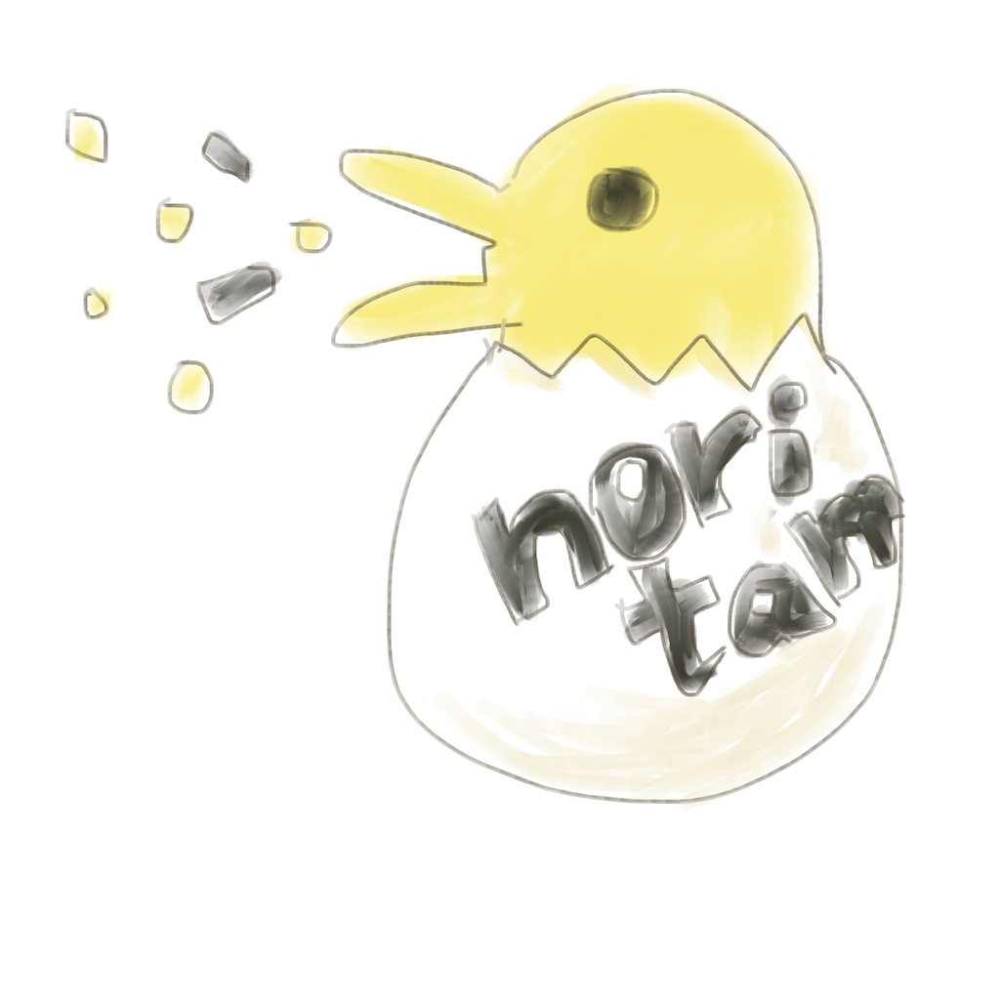

# NoritamaFlake

- NoritamaFlake is a library that generates decentralized and K-ordered id, affected by SnowFlake and ObjectId(Mongo-id)
- Implemented in pure Rust

[](https://app.wercker.com/project/byKey/382077604451cce44310e6ee76b05c84)
[](LICENSE)


<p align="center">

</p>

## Key features
- Globally unique
- K-ordered
- Decentralized
  - local ip is cluster safe
  - multi process
- Configuration free
- Compact representation
  - URL-safe

## [TODO] Specification

```
[timestamp:40bit][sequence:16bit][machine-id:32bit][process-id:8bit]

hex sample: 0677c8ecd600007f0000014a
```

## [TODO] Limitation
- Expiration date is 34 years from epoch

## Usage

### [WIP] Library
- Issue a new id(use default Epoch)

````rust
//! ```cargo
//! [dependencies]
//! noritama = { git = "https://github.com/watawuwu/noritama" }
//! ```

use noritama::flake::*;
use noritama::flaker::*;

// create client
let flaker: Flaker = Flaker::new().unwrap();

// create id
let flake : Flake  = flaker.id().unwrap();
let id    : String = flake.hex();
````

- Specify the epoch

````rust
//! ```cargo
//! [dependencies]
//! noritama = { git = "https://github.com/watawuwu/noritama" }
//! time     = "*"
//! ```

use noritama::flake::*;
use noritama::flaker::*;
use time::*;

// create client
let epoch : Tm     = time::now;
let flaker: Flaker = Flaker::new_with_epoch_timestamp(epoch).unwrap();

// create id
let flake : Flake  = flaker.id().unwrap();
let id    : String = flake.hex();
````

### [WIP] Command line
- Help

```
$ noritama -h
Noritama produces k-sorted ids. 0.1
watawuwu <watawuwu@gmail.com>
Noritama produces k-sorted ids.

USAGE:
    noritama [OPTIONS]

FLAGS:
    -h, --help       Prints help information
    -V, --version    Prints version information

OPTIONS:
    -d, --decode <decode>              decoded hexed id
    -s, --start-epoch <start-epoch>    epoch used for internal timestamp
```

- Issue a new id

```
$ noritama
0677c8ecd600007f0000014a

```
- Decode id

```
$ noritama -d 0677c8ecd600007f0000014a
hex: 0677c8ecd600007f0000014a([6, 119, 200, 236, 214, 0, 0, 127, 0, 0, 1, 74]), unix_ts: 1485693060310, internal_ts: 27779460310, seq: 0, mid: 2130706433, pid: 74, start_epo: 1457913600000
```

## [TODO] Comparison

| Name          | Bit          | Representation | Configuration  | Sortable | Feild |
| ------------- |:-------------:|:-------------|:-------------|:-------------| :----|
| UUID |128bit | 36chars(16base)| free| no| timestamp(60bit):<br>=>3653 years<br>clock sequence(14bit):<br>=>random + inc<br>node(40bit):<br>=>MAC address|
| Cassandra UUID(v1?)| 128bit| 36chars(16base)| free| no| timestamp(60bit):<br>=>3653 years<br>clock sequence(14bit):<br>=>random + inc<br>node(40bit):<br>=>IP address|
| ObjectId<br>(mongo-id)| 96bit| 24chars[16base]| free| yes| timestamp(32bit):<br>=>second<br>machine-id(24bit):<br>process-id(16bit)<br>counter(24bit)|
| Snowflake| 64bit| 20chars(10base)| machine/DC| yes| timestamp(41bit)<br>=>69 year<br>machine-id(5bit):<br>=>central<br>process-id(5bit)<br>counter(12bit)|
| Flake(by Erlang)| 128bit| 18chars(62base)| no| yes|  timestamp(64bit)<br>worker-id(48bit):<br>=>MAC Address<br>sequence(16bit)|
| NoritamaFlake| 96bit| 24chars(16base)| no| yes| timestamp(40bit):<br>=>34 year<br>sequence(16bit):<br>=>inc<br>machine-id(32bit):<br>=>ip address(ip4)<br>process-id(8bit)


